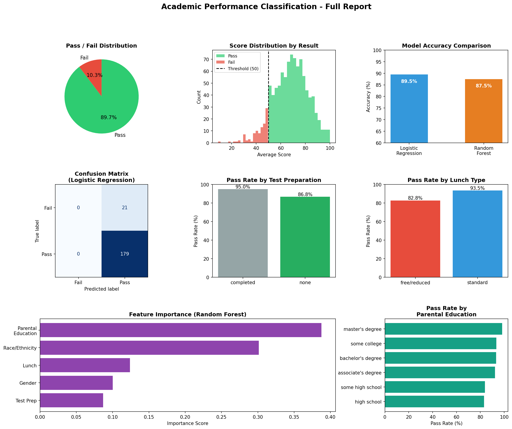

<p align="center">
  
</p>

<h1 align="center">🎓 Student Performance Predictor — EduMetrics</h1>

<p align="center">
  <b>AI-powered student pass/fail classification with interactive analytics dashboard</b><br/>
  <i>Built with Scikit-learn · Logistic Regression & Random Forest</i>
</p>

<p align="center">
  
  
  
  
</p>

---

## 📌 Overview

**EduMetrics** is a machine learning project that predicts whether a student will **pass or fail** based on their academic scores and socio-demographic background. It combines a Python ML pipeline with a sleek, interactive web-based dashboard for real-time predictions and analytics.

### Key Features

- 🤖 **Dual Model Comparison** — Logistic Regression vs. Random Forest, with automatic best-model selection
- 📊 **Comprehensive Visualizations** — 8-panel report including confusion matrix, feature importance, and demographic breakdowns
- 🌐 **Interactive Web Dashboard** — Full-featured single-page application with prediction engine, analytics, history tracking, and model info
- 🎯 **Risk Assessment** — Confidence scoring and risk-level indicators for each prediction
- 💡 **Actionable Insights** — Auto-generated recommendations based on prediction results

---

## 🏗️ Project Structure

```
📁 Student-Performance-Predictor-EduMetrics/
├── 📄 student_model.py           # ML pipeline (data loading → training → evaluation)
├── 🌐 edumetrics_platform.html   # Interactive web dashboard (standalone)
├── 📊 model_report.png           # Generated 8-panel visualization report
├── 📊 model_report (1).png       # Duplicate report (alternate run)
├── 📄 README.md                  # Project documentation
├── 📄 LICENSE                    # MIT License
└── 📄 .gitignore                 # Git ignore rules
```

---

## 🔬 Machine Learning Pipeline

### Dataset

- **Source**: [Students Performance in Exams](https://www.kaggle.com/datasets/spscientist/students-performance-in-exams) (Kaggle)
- **Records**: 1,000 students
- **Features**: Gender, Race/Ethnicity, Parental Education, Lunch Type, Test Preparation Course
- **Target**: Pass/Fail (average of Math + Reading + Writing scores ≥ 50)

### Pipeline Steps

| Step | Description |
|------|-------------|
| 1 | Load and inspect dataset |
| 2 | Exploratory Data Analysis (missing values, distributions) |
| 3 | Create binary target variable (Pass ≥ 50 avg, Fail < 50) |
| 4 | Encode categorical features using `LabelEncoder` |
| 5 | Prepare feature matrix (X) and target vector (y) |
| 6 | Train-test split (80/20, stratified) |
| 7 | Train Logistic Regression & Random Forest classifiers |
| 8 | Evaluate with accuracy, precision, recall, F1-score |
| 9 | Generate 8-panel visualization report |
| 10 | Run sample prediction demo |

### Model Performance

| Model | Accuracy |
|-------|----------|
| Logistic Regression | **89.5%** ✅ |
| Random Forest | **87.5%** |

> **Best Model**: Logistic Regression was selected as the primary model with **89.5% accuracy**, demonstrating strong predictive performance on student pass/fail classification.

---

## 🌐 Web Dashboard

The **EduMetrics Platform** (`edumetrics_platform.html`) is a fully standalone, single-file web application featuring:

| Page | Description |
|------|-------------|
| **Predict** | Input student scores & background → get real-time pass/fail prediction with confidence, risk meter, and recommendations |
| **Analytics** | Interactive charts showing dataset distributions, pass rates by demographics, and score breakdowns |
| **History** | Session-based prediction log with sortable columns |
| **Model Info** | Side-by-side model comparison, confusion matrix, feature importance, and classification metrics |

### How to Use

1. Open `edumetrics_platform.html` in any modern browser
2. Navigate to the **Predict** page
3. Enter student scores (Math, Reading, Writing) and background info
4. Click **Run Prediction** to see the result

---

## 🚀 Getting Started

### Prerequisites

```bash
pip install pandas numpy matplotlib seaborn scikit-learn
```

### Run the ML Pipeline

```bash
python student_model.py
```

> ⚠️ **Note**: Update the dataset path in `student_model.py` (line 28) to point to your local copy of `StudentsPerformance.csv`.

### Launch the Dashboard

Simply open `edumetrics_platform.html` in your browser — no server required.

---

## 📊 Visualization Report

The pipeline generates an 8-panel visualization:

1. **Pass/Fail Distribution** — Pie chart of class balance
2. **Score Distribution** — Histogram with pass threshold overlay
3. **Model Accuracy Comparison** — Bar chart of both models
4. **Confusion Matrix** — True/False positives and negatives
5. **Pass Rate by Test Prep** — Impact of preparation courses
6. **Pass Rate by Lunch Type** — Socio-economic indicator analysis
7. **Feature Importance** — Random Forest feature ranking
8. **Pass Rate by Parental Education** — Education level correlations

---

## 🛠️ Tech Stack

| Component | Technology |
|-----------|------------|
| ML Pipeline | Python, Pandas, NumPy, Scikit-learn |
| Visualization | Matplotlib, Seaborn |
| Web Dashboard | HTML5, CSS3, Vanilla JavaScript |
| Typography | Google Fonts (Sora, Lora, IBM Plex Mono) |
| Design | Custom CSS with CSS variables, responsive layout |

---

##  License

This project is licensed under the MIT License — see the [LICENSE](LICENSE) file for details.
